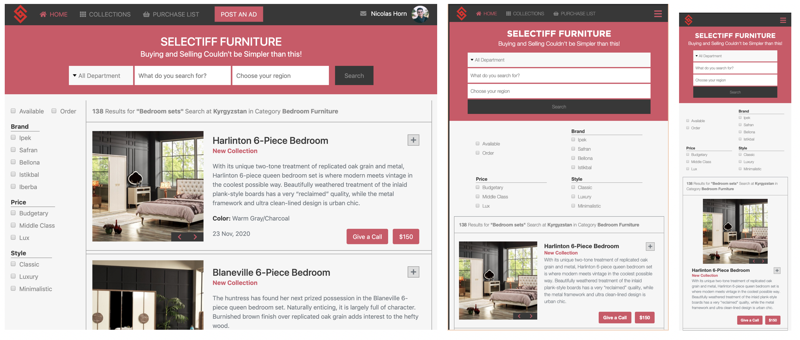

# Online Shop for Furniture Store
I built a 2-page online shop for local furniture store:
- the main page with categories listed with search feeature, 
- that leads to the search results page

## Project features:
1. Project is considering responsiveness on each Bootstrap breakpoint (screenshots for breakpoints below)
2. Most of the styling and positioning is done using Bootstrap
3. Categories in the main page has horizontal scroll posibility

## Built With

- HTML, CSS3
- Bootstrap 4
- Flexbox
- Fontawesome
- Media Queries
- Font imports

## Screenshot

## Live Demo

[Check it out!](https://online-shop-website.netlify.com/)

## Author

👤 **Azamat Nuriddinov**

- Github: [@bettercallazamat](https://github.com/bettercallazamat)
- Twitter: [@azamat_nuriddin](https://twitter.com/azamat_nuriddin)
- Linkedin: [Azamat Nuriddinov](https://www.linkedin.com/in/azamat-nuriddinov-57579868)

## 🤝 Contributing

Contributions, issues and feature requests are welcome!

Feel free to check the [issues page](issues/).

## Show your support

Give a ⭐️ if you like this project!

## Acknowledgments
This project was build based on [the design](https://www.behance.net/gallery/24796463/ZATTIX) from behance.com which is designed by the great professional [Mohammed Awad](https://www.behance.net/M_Awad).