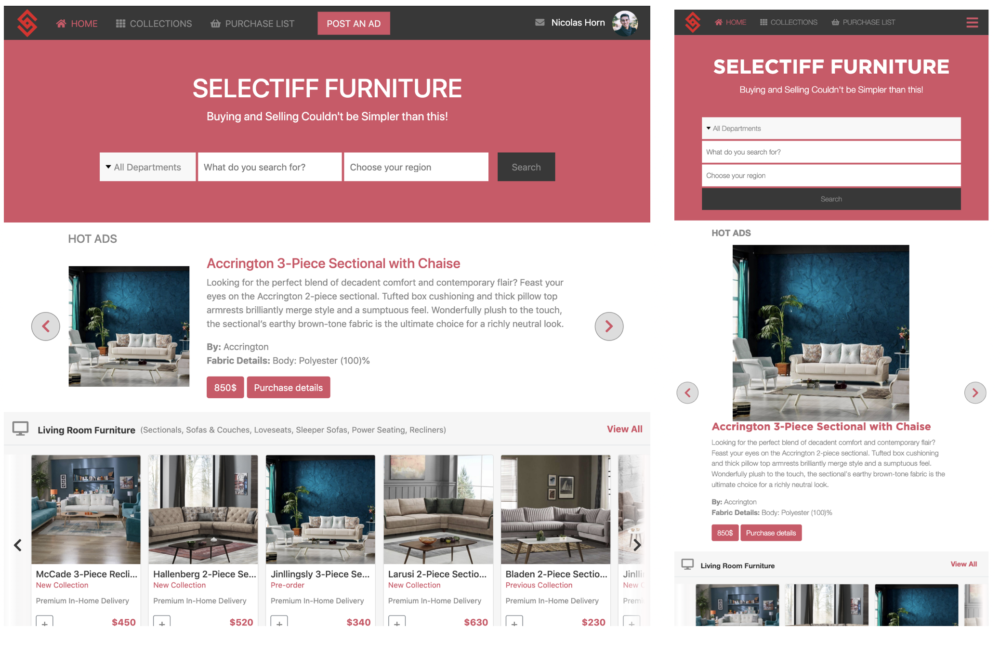
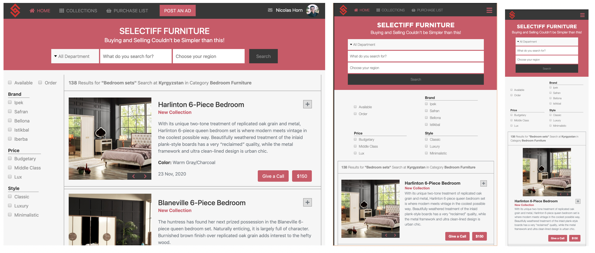

# Online Shop for Furniture Store
I built an 2 page online shop for local furniture store:
- the main page with categories listed and search feeature, 
- with a link to the search results page

## Project features:
1. Project considers responsiveness on each Bootstrap breakpoint (screenshots for breakpoints below)
2. Most of the styling and position is done using Bootstrap
3. Categories in main page is with horizontal scroll posibility

## Built With

- HTML, CSS3
- Bootstrap 4
- Flexbox
- Fontawesome
- Media Queries
- Font imports

## Screenshot

## Live Demo

[Check it out!](https://online-shop-website.netlify.com/)

## Author

👤 **Azamat Nuriddinov**

- Github: [@bettercallazamat](https://github.com/bettercallazamat)
- Twitter: [@azamat_nuriddin](https://twitter.com/azamat_nuriddin)
- Linkedin: [Azamat Nuriddinov](https://www.linkedin.com/in/azamat-nuriddinov-57579868)

## 🤝 Contributing

Contributions, issues and feature requests are welcome!

Feel free to check the [issues page](issues/).

## Show your support

Give a ⭐️ if you like this project!